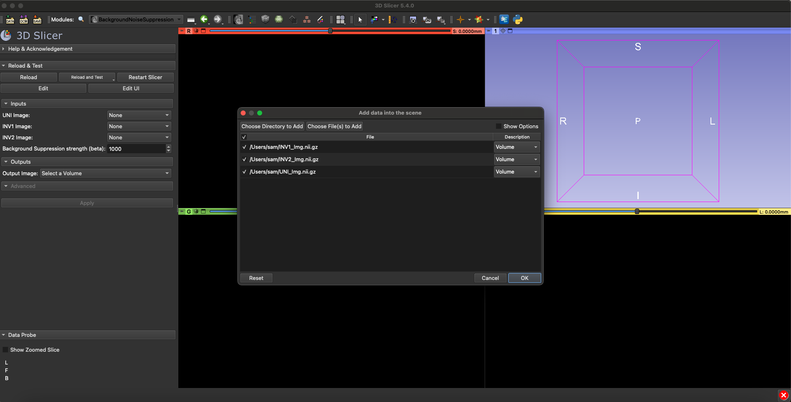
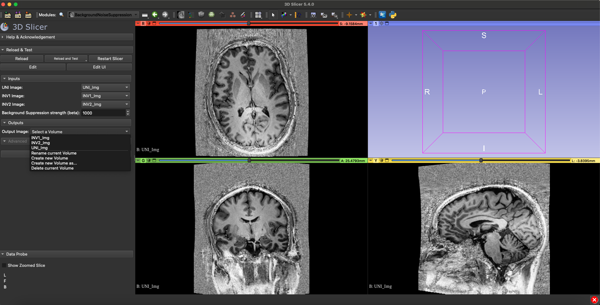

# SlicerMp2rageBackgroundSuppression
This is an extension for 3D Slicer that is used to filter background noise (aka denoising) for MP2RAGE Image acquisitions.

## Instructions for manual installation of extension (via github)

NOTE: This is only for developmental purposes and for slicer extension download refer to xxxxx

1.	Open a terminal, change directory to the path that you will input into Step 3, and type into the command line:
   
`git clone git@github.com:harellab/SlicerMp2rageBackgroundSuppression.git`

2.	Open Slicer and go to Edit &rarr; Application Settings &rarr; Modules
3.	Copy the mp2rageBackgroundSuppression directory path into the Additional module paths and click ok

Note: the module path will be the directory where the github was cloned with ~/mp2rageBackgroundSuppression/BackgroundNoiseSuppression

## Required Inputs:
1. MP2RAGE uniform images (UNI) 
2. The first inversion recovery sequence (INV1) from MP2RAGE
3. The second inversion recovery sequence (INV2) from MP2RAGE

## Extension Workflow:
1. Load the MP2RAGE data sets (UNI, INV1, INV2) into 3D Slicer as volumes.

2. Select the corresponding UNI, INV1, and INV2 volumes.  The supression strength is normalized relative to an estimated noise variance calculated at the corner of the image.  The default suppression strength is set at 1000; useful suppression strength may scale several orders of magnitude.  Higher suppression strength trades increased background noise suppression for increased bias field effects.
3. To filter the background noise, create a new volume or select an existing volume.

## Disclaimer

Mp2rageBackgroundSuppression, same as 3D Slicer, is a research software. It is NOT an FDA-approved medical device. It is not intended for clinical use. The user assumes full responsibility to comply with the appropriate regulations.

## Support

Please feel free to contact The Harel Lab github organization for questions, feedback, suggestions or bugs. https://github.com/harellab/SlicerMp2rageBackgroundSuppression/issues

## Acknowledgments

Development of mp2rageBackgroundSuppression was supported in part by the following NIH grants:
Udall NIH P50 NS123109
