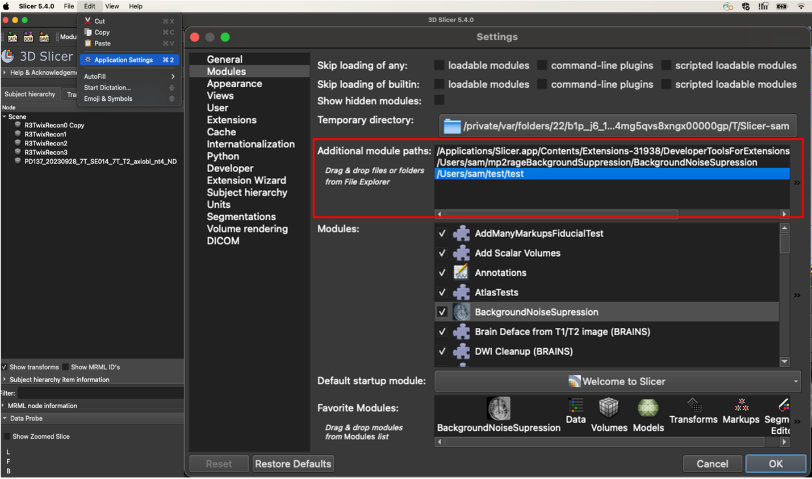
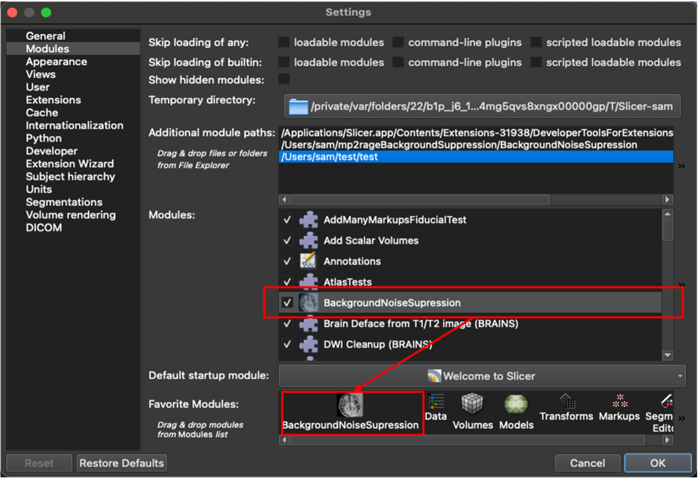

# SlicerMp2rageBackgroundSuppression

This is an extension for 3D Slicer that provides tools for working with MRI
images using the MP2RAGE contrast. Currently it supplies a single tool for suppressing divide-by-zero background noise (aka denoising).

The MP2RAGE MRI contrast[1](#1) is acquired by simultaneously collecting two MPRAGE images at different inversion times and combining them to form a new, derived contrast. MP2RAGE generates excellent T1-weighted images and is useful for generating other derived contrasts (e.g. T1 maps, synthetic white matter-nulled T1s, and synthetic FGATIR[2](#2)). However, it contains “salt-and-pepper” noise, rather than zero values, in areas of low or no signal. This noise can cause algorithms developed for traditional T1 images processing to fail. A “denoising” (more accurately, background suppression) method for eliminating such noise has been published[3](#3), but it relies on additional phase data which is typically not available. This extension implements a method for retrospectively applying a similar noise suppression approach which relies only on available scanner output images.

## Installation Instructions
1. In Slicer, open the Extensions Manager 
(View &rarr; Extensions Manager).

2. Search for `MP2RAGE` and click `INSTALL`

3. Restart Slicer.

### Alternate Installation Method: Manual Installation Via Github
For development and testing, the extension may also be installed from the
project's GitHub repository.

1.	Open a terminal, change directory to the path that you will input into Step 3, and type into the command line:
   
    `git clone git@github.com:harellab/SlicerMP2RAGE.git`

2.	Open Slicer and go to Edit &rarr; Application Settings &rarr; Modules
3.	Copy the mp2rageBackgroundSuppression directory path into the Additional module paths and click ok

    Note: the module path will be the directory where the github was cloned 
    with ~/SlicerMP2RAGE-Trunk/BackgroundNoiseSuppression

4. Restart Slicer and go back to 
Edit &rarr; Application Settings &rarr; Modules. Make sure the BackgroundNoiseSupression module checkbox is checked, click and drag the module to the Favorite Modules list.

## Usage

### Required Inputs:
1. MP2RAGE uniform images (UNI) 
2. The first inversion recovery sequence (INV1) from MP2RAGE
3. The second inversion recovery sequence (INV2) from MP2RAGE

### Extension Workflow:
1. Load the MP2RAGE data sets (UNI, INV1, INV2) into 3D Slicer as volumes.

2. Select the corresponding UNI, INV1, and INV2 volumes.  The supression strength is normalized relative to an estimated noise variance calculated at the corner of the image.  The default suppression strength is set at 1000; useful suppression strength may scale several orders of magnitude.  Higher suppression strength trades increased background noise suppression for increased bias field effects.
3. To filter the background noise, create a new volume or select an existing volume.

## Disclaimer

Mp2rageBackgroundSuppression, same as 3D Slicer, is a research software. It is NOT an FDA-approved medical device. It is not intended for clinical use. The user assumes full responsibility to comply with the appropriate regulations.

## Support

Please feel free to contact The Harel Lab github organization for questions, feedback, suggestions or bugs. https://github.com/harellab/SlicerMP2RAGE/issues

## Acknowledgments

Development of mp2rageBackgroundSuppression was supported in part by the following NIH grants:
Udall NIH P50 NS123109

## References
<a id="1">1.</a> Marques JP, Kober T, Krueger G, Van Der Zwaag W, Van De Moortele PF, Gruetter R. MP2RAGE, a self bias-field corrected sequence for improved segmentation and T1-mapping at high field. *NeuroImage*. 2010;49(2):1271-1281. doi:10.1016/j.neuroimage.2009.10.002

<a id="2">2.</a> Middlebrooks EH, Tao S, Zhou X, et al. Synthetic Inversion Image Generation using MP2RAGE T1 Mapping for Surgical Targeting in Deep Brain Stimulation and Lesioning. *Ster Funct Neurosurg*. 2023;101(5):326-331. doi:10.1159/000533259

<a id="3">3.</a> O’Brien KR, Kober T, Hagmann P, et al. Robust T1-Weighted Structural Brain Imaging and Morphometry at 7T Using MP2RAGE. Margulies D, ed. *PLoS ONE*. 2014;9(6):e99676. doi:10.1371/journal.pone.0099676
